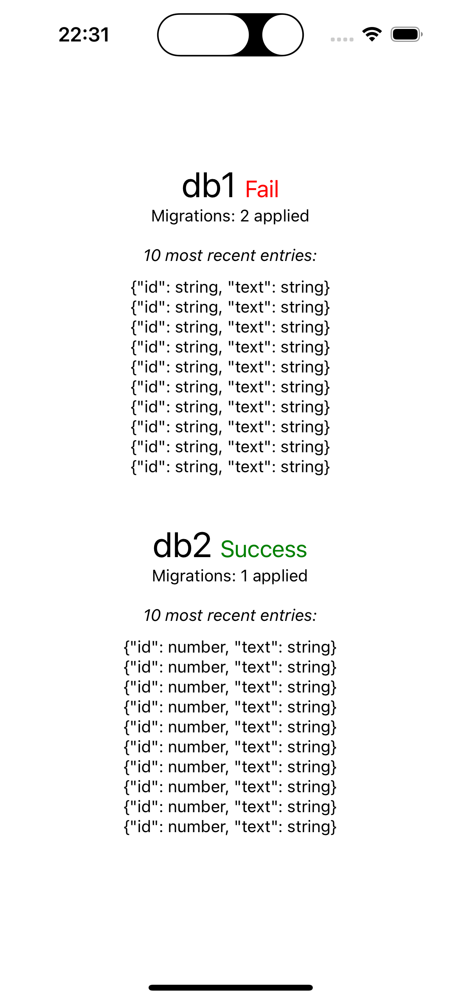

# repro-bad-type-drizzle-expo-sqlite

## Install

```bash
npm install
```

## Run

```bash
npm start
```

This will start the Expo Go server. You can then scan the QR code with your phone to run the app.

## Issue

It seems that when there is multiple migrations, Drizzle migrates the first one, but the others are not migrated.



## What does this repro do?

There is two DB (defined in [`database/database.ts`](./database/database.ts)), and two migrations folders ([`database/migrations1`](./database/migrations1) and [`database/migrations2`](./database/migrations2)).

### First DB and migrations folder

The first migration creates a table with a `TEXT` column `id`.
The second migration changes the `id` column to `INTEGER`.

**Result:** On the screenshot above, we can see that the `id` is a `string`, which is the type of the first migration. The second migration is not applied.

### Second DB and migrations folder

The first and only migration creates a table with a `TEXT` column `id`.

**Result:** On the screenshot above, we can see that the `id` is a `number`, as expected.
